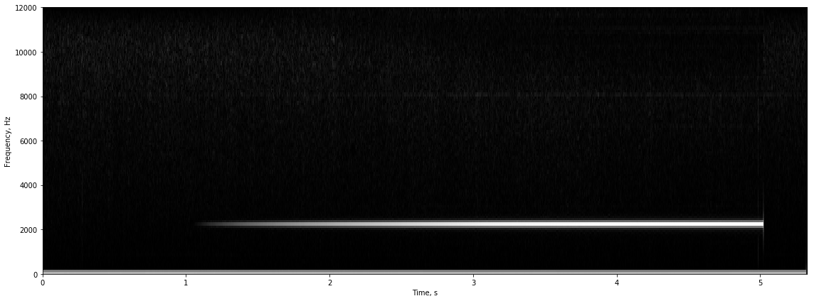

# Lab 4, Radio Communication Via a RPiTX and the SDR


This is an alpha version of the lab, ment for those who have issues with their radios, the audio interface, or have not gotten a radio from a number of reasons. I developed this lab over Spring break 2020, being sheltered in place due to the COVID19 virus epidemic. 

Please not again, this is an ALPHA version, and has not been debugged almost at all -- so things may not work, break or vary for different people. Please bare that in mind and work with us to perfect this lab. 


In this lab you will receive RF signals using the RTL-SDR, and transmit signals using the Raspberry pi itself. This lab heavily uses open several amazing open source projects, which I'm greatful for. 


## Turning the Raspberry Pi into a transmitter:
The original work for this hack was created by the Imperial College Robotic Society, it was later extended by Oliver Mattos and Oskar Weigle to the PiFM code, and finally a full fledged package called RPiTX by Evariste Courjad (F50EO). 

The hack uses hardware on the raspberry pi that is actually meant to generate variable frequencies, computer controlled clock signals on the GPIO pins. By cleverly using DMA and inputting different frequencies for different times, the software can generate a Frequency Modulated (FM) signal out of GPIO pin #4 of the raspberry pi. 
Any frequency between 0 and 250MHz can be set. Because the carrier signal is a square wave, the signal produced has *very* strong harmonics. By using the harmonics it is possible to generate carriers even at 1GHz. 

When connected to an antenna, or a wire, this "radio" will reslult in illegal emmissions. But withour any wire or antenna connected to the pins, the amount of power emmitted is small and only detectable for a few feet. This will enable us to use this approach for this lab, without implementing a bandpass filter. 

This code, along with RTL-SDR and CSDR are the basis for making this lab work. 

### References:

* [ICRobotics](http://www.icrobotics.co.uk/wiki/index.php/Turning_the_Raspberry_Pi_Into_an_FM_Transmitter)
* [PiFM github](https://github.com/rm-hull/pifm)
* [RPiTX github](https://github.com/F5OEO/rpitx)
* [librtlsdr](https://github.com/librtlsdr/librtlsdr)
* [CSDR](https://github.com/ha7ilm/csdr)

## The Radio Class (wrapping rtlsdr and rpitx in python)

The way I implemented the "Radio" is by calling shell commands that uses rtl_fm (a software for demodulating FM radio signal using rtlsdr) rpitx and CSDR. To pipe the audio into and out of python, we leverage the loopback audio device, which is a virtual device enabling piping of audio between application. 

In order for this to work you need to have snd_aloop linux kernel module loaded. You also need to be able to run sudo without needing to enter a password. 

Make sure you do the following: open a terminal on the pi, through SSH, bluetooth or serial connection. 

1. In the terminal, type:
~~~~
sudo visudo
~~~~

Append the following line to the end of the file, and save:
~~~~
pi ALL=(ALL) NOPASSWD:ALL
~~~~

You should now be able to run sudo without a password. 

2. In the terminal, type:
~~~~
sudo modprobe snd_aloop
~~~~

This will load the loopback audio module. NOTE, this is not persistant, and you will need to do this every time you boot. 

Two important audio devices that are created are: `plughw:CARD=Loopback,DEV=0`,  and `plughw:CARD=Loopback,DEV=1`. These are the loopback devices. We will use `DEV=1` from python and `DEV=0` from outside.

The following code should show if the Loopback module was loaded and the devices are set. You should see:
~~~~
plughw:CARD=Loopback,DEV=0
plughw:CARD=Loopback,DEV=1
~~~~
If it worked.


```python
# the following code should show if the Loopback module was loaded and the devices are set.

! aplay -L | grep plughw:CARD=Loopback,DEV=
```

    plughw:CARD=Loopback,DEV=0
    plughw:CARD=Loopback,DEV=1


3. Because of some HW interferences issues, the rpitx provided in your installation will have hardware collisions with the sound interface. To minimize it, we patched rpitx, and provided you with  an executable. You need to copy that executable to /usr/bin/ by:

```
sudo cp rpitx /usr/bin
```


```python
! sudo cp rpitx /usr/bin/
```

Import the radio class, spectrogram and spectrum display from lab4_2_utils.py


```python
from lab4_2_utils import *
```


```python
# Import functions and libraries

import numpy as np
import matplotlib.pyplot as plt
import pyaudio, threading,time, sys, threading,time, serial
import queue as Queue
from numpy import pi, sin, zeros, r_
from scipy import signal
from rtlsdr import RtlSdr
import sounddevice as sd
#import RPi.GPIO as GPIO
%matplotlib inline
```


```python
# set up alsamixer volumes for the raspberry pi

!amixer -c 1 -- sset 'Capture Mux' 'LINE_IN'
!amixer -c 1 -- sset Lineout playback unmute
!amixer -c 1 -- sset Lineout playback  50%,50%
!amixer -c 1 -- sset Mic capture  67%
!amixer -c 1 -- sset Mic playback  59%

```

    Simple mixer control 'Capture Mux',0
      Capabilities: enum
      Items: 'MIC_IN' 'LINE_IN'
      Item0: 'LINE_IN'
    Simple mixer control 'Lineout',0
      Capabilities: pvolume pswitch pswitch-joined
      Playback channels: Front Left - Front Right
      Limits: Playback 0 - 31
      Mono:
      Front Left: Playback 16 [52%] [-7.50dB] [on]
      Front Right: Playback 16 [52%] [-7.50dB] [on]
    Simple mixer control 'Lineout',0
      Capabilities: pvolume pswitch pswitch-joined
      Playback channels: Front Left - Front Right
      Limits: Playback 0 - 31
      Mono:
      Front Left: Playback 16 [52%] [-7.50dB] [on]
      Front Right: Playback 16 [52%] [-7.50dB] [on]
    Simple mixer control 'Mic',0
      Capabilities: volume volume-joined
      Playback channels: Mono
      Capture channels: Mono
      Limits: 0 - 3
      Mono: 3 [100%] [40.00dB]
    Simple mixer control 'Mic',0
      Capabilities: volume volume-joined
      Playback channels: Mono
      Capture channels: Mono
      Limits: 0 - 3
      Mono: 2 [67%] [30.00dB]


## Testing Audio I/O, and Radio Receive

We will use the sounddevice python package for audio. 

### Testing the  Audio:

The first test/example would be to see if we can capture audio from the radio and play it on the raspberry pi.


#### An important feature in this task is that you will have a method to check if the incoming signal is being clipped. Remember the settings for which the signal maximum is 0.6.  This would be VERY useful in the communications part of the lab -- this is less of a problem for the sdr+rpitx setup than the audio inteface and the baofeng, but still..


#### Another important caviat -- Due to intefereing devices within the pi, it is not possible to transmit with rpitx and --  also -- play sound using any of the sound interfaces.  Any attempt to do so, will require a restart. Don't say I did not warn you!!!


Let's Start a Radio object:


```python
R = Radio()

```

Let's set the frequency to a local FM station. At Berkeley, it would be 94.1MHz, or 94100KHz. We will also route the radio output directly to the Fe-Pi audio. Make sure your speaker is connected to the RX/Speaker green connector. Make sure the SDR gain is set appropriately. Gain of 36 is reasonable.  


```python
R.audiodev_out = "plughw:CARD=Audio,DEV=0"
R.freq_rx = 94100.0
R.sdr_gain = 36
```

We are ready to run the Wide-band FM receiver. After running, you will see the shell commandline that was used. 


```python
R.WBFMrx()
```

    /usr/bin/rtl_fm -f 94100000.000 -s 240k -g 36.000000  -r 48000  -o 4  -A LUT  -E deemp - | aplay -t raw -r 48000 -f s16_LE -c 1 -D plughw:CARD=Audio,DEV=0


To stop the device we run R.stoprx(), or R.close(). The latter will also kill any transmitter. 


```python
#R.stoprx()
R.close()
```

We would like to run the radio while piping the audio to the loopback audio device, so we can read it within python. We will first need to set the audio. We will be using the SoundDevice python audio library. 

The following command will list the audio devices on your pi. You should see:
```
 0 bcm2835 ALSA: - (hw:0,0), ALSA (0 in, 2 out)
  1 bcm2835 ALSA: IEC958/HDMI (hw:0,1), ALSA (0 in, 2 out)
  2 Fe-Pi Audio: - (hw:1,0), ALSA (2 in, 2 out)
  3 Loopback: PCM (hw:2,0), ALSA (32 in, 32 out)
  4 Loopback: PCM (hw:2,1), ALSA (32 in, 32 out)
  5 sysdefault, ALSA (0 in, 128 out)
  6 dmix, ALSA (0 in, 2 out)
* 7 default, ALSA (2 in, 2 out)
```
You may see something slightly different than the above. 
But, if you don't see a loopback, you need to repeat the `sudo modprobe snd_aloop`. If you don't see the Fe-Pi Audio device, then it means that something is off. Try rebooting! 


```python
sd.query_devices()


```


      0 bcm2835 ALSA: - (hw:0,0), ALSA (0 in, 2 out)
      1 bcm2835 ALSA: IEC958/HDMI (hw:0,1), ALSA (0 in, 2 out)
      2 Fe-Pi Audio: - (hw:1,0), ALSA (2 in, 2 out)
      3 Loopback: PCM (hw:2,0), ALSA (32 in, 32 out)
      4 Loopback: PCM (hw:2,1), ALSA (32 in, 32 out)
      5 sysdefault, ALSA (0 in, 128 out)
      6 dmix, ALSA (0 in, 2 out)
    * 7 default, ALSA (2 in, 2 out)


Manually set the audio device numbers. 

builtin_idx = 2 #should be the Fe-Pi Audio

loop1_idx  = 4 #should be Loopback: PCM (hw:2,1)


```python
builtin_idx = 2  #should be the Fe-Pi Audio
loop1_idx = 4 #should be Loopback: PCM (hw:2,1)

```

We will also set up default of 1 channel, and sampling rate of 48Khz:


```python
# set default sample rate and number of channels. 

sd.default.samplerate=48000
sd.default.channels = 1
```

The code below shows how to read data from a device, using a callback function and a stream. The callback function in this case is simple, it copies the input data stream (loop1) to an output data stream (builtin), so we can hear what is being streamed by the radio. 


```python
# this callback function will play captured data 
# it will be called by the soundevice stream and run in a different thread

def replay_callback(indata,outdata, frames, time, status):
    if status:
        print(status)
    outdata[:] = indata  # the [:] is important so data is copied not referenced !


```

Let's set up a new radio. Since the default device when starting the radio is the loopback, we can just create a new one, and set frequencies and gains. Then, run the WBFM receiver again. And start receiving FM radio.


```python
R = Radio()
R.freq_rx = 94100.0
R.sdr_gain = 36
#R.audiodev_out = "plughw:CARD=Loopback,DEV=0"   #optional, since it is a default.
R.WBFMrx()
```

    /usr/bin/rtl_fm -f 94100000.000 -s 240k -g 36.000000  -r 48000  -o 4  -A LUT  -E deemp - | aplay -t raw -r 48000 -f s16_LE -c 1 -D plughw:CARD=Loopback,DEV=0


```python

# create stream
# Will record from device 5 and play through device 3 
st = sd.Stream(device=(loop1_idx,builtin_idx),callback=replay_callback)


# start stream -- will run in background till stopped
st.start()


```


```python
# stop and close stream -- must stop and close for clean exit

st.stop()
st.close()
R.stoprx()
```

#### You can change the volume of the audio by setting R.audio_rcv_gain, which can be any positive floating point number. 


```python
R = Radio()
R.freq_rx = 94100.0
R.sdr_gain = 36
#R.audiodev_out = "plughw:CARD=Loopback,DEV=0"   #optional, since it is a default.
R.audio_rcv_gain = 0.1
R.WBFMrx()


 
# create stream
# Will record from device "loop1" and play through device "builtin"
st = sd.Stream(device=(loop1_idx,builtin_idx),callback=replay_callback)

# start stream -- will run in background till stopped
st.start()


```

    /usr/bin/rtl_fm -f 94100000.000 -s 240k -g 36.000000  -r 48000  -o 4  -A LUT  -E deemp - | csdr convert_s16_f | csdr gain_ff 0.100000 | csdr convert_f_s16 | aplay -t raw -r 48000 -f s16_LE -c 1 -D plughw:CARD=Loopback,DEV=0


```python
# stop and close stream -- must stop and close for clean exit

st.stop()
st.close()
R.stoprx()
```

The following callback will do exactly the same thing as before. The only difference is that the received audio will be pushed to a Queue so we can process it outside of the callback function. Default block-sizes are 512 samples, which is about 10ms worth of samples -- this seems to be a problem for the pi. We will therefore use a 1024 samples long, which is about 20ms worth of samples. 

We will capture just over 10 seconds, about 500 blocks. The samples from the queue will be processed. We will compute the maximum signal and the root-mean-square (RMS) for each block. This will let us see if the signal is being clipped. 


```python
def queuereplay_callback(indata,outdata, frames, time, status):
    assert frames == 1024
    if status:
        print(status, file=sys.stderr)
        
    outdata[:] = indata # Keep this only if you are not transmitting!
    Qin.put( indata.copy() )  # Global queue

```


```python
R = Radio()
R.freq_rx = 94100.0
R.sdr_gain = 36
#R.audiodev_out = "plughw:CARD=Loopback,DEV=0"   #optional, since it is a default.
R.audio_rcv_gain = 3.0
R.WBFMrx()
```

    /usr/bin/rtl_fm -f 94100000.000 -s 240k -g 36.000000  -r 48000  -o 4  -A LUT  -E deemp - | csdr convert_s16_f | csdr gain_ff 3.000000 | csdr convert_f_s16 | aplay -t raw -r 48000 -f s16_LE -c 1 -D plughw:CARD=Loopback,DEV=0


```python

# create an input FIFO queue
Qin = Queue.Queue()

st = sd.Stream( device=(loop1_idx, builtin_idx),blocksize=1024, callback=queuereplay_callback)

st.start()

# record and play about 10.6 seconds of audio 500*1024/48000 = 10.6 s
mxpwr = zeros(500)
rmspwr = zeros(500)

for n in range(0,500):
    
    samples = Qin.get()
    mxpwr[n] = max(abs(samples))
    rmspwr[n] = np.sqrt(np.sum(np.square(samples)))
    # You can add code here to do processing on samples in chunks of 512 samples
    # In general, you will have to implement an overlap and add, or overlap an save to get
    # continuity between chunks -- we will do this later!
    
st.stop()
st.close()

# empty queue just in case there's something left
while not(Qin.empty()) :
    samples=Qin.get()
R.stoprx()
```

* The code also displays the RMS power and Maximum audio signal for each 512 samples block -- so you can see if it is clipped, or too weak.


```python
fig = plt.figure(figsize=(16,4))
t = r_[0:500]*1024/48000
plt.plot(t,mxpwr)
plt.plot(t,rmspwr/np.sqrt(512))
plt.title('Maximum/RMS power')
plt.legend(('Max signal','rms power'))

if any(mxpwr > 0.95):
    print("Warning! Signal is clipped. Reduce radio volume, and/or usb device input volume")
if max(mxpwr) < 0.3:
    print("Audio Volume may be too low. Increase the volume on the radio for better lab performance")
```


Make sure you set the volume such that the peak is not higher than 0.8

The "radio" is also able to demodlulate narrow-band FM, such as Walkie Talkies, NOAA weather, and the Baofeng Radio.
Pick a local NOAA weather frequency: repeater frequency,  (162.400 megahertz (MHz), 162.425 MHz, 162.450 MHz, 162.475 MHz, 162.500 MHz, 162.525 MHz, and 162.550 MHz), or if you have a baofeng radio and a license, choose an amateure radio band (one of the experimental frequencies programmed on your radio) and test the receiver. Repeat the recording and power experiment from above with narrowband FM. You can transmit while pressing on the keys to play DTMF tones. 


The code: ``R.NFMrx()`` starts a narrowband FM receiver. 


```python
R = Radio()
R.freq_rx = 162425.0
R.sdr_gain = 36
#R.audiodev_out = "plughw:CARD=Loopback,DEV=0"   #optional, since it is a default.
R.audio_rcv_gain = 2.0
R.NFMrx()


# create an input FIFO queue
Qin = Queue.Queue()

st = sd.Stream( device=(loop1_idx, builtin_idx),blocksize=1024,callback=queuereplay_callback)

st.start()

# record and play about 10.6 seconds of audio 1000*512/48000 = 10.6 s
mxpwr = zeros(1000)
rmspwr = zeros(1000)

for n in range(0,1000):
    
    samples = Qin.get()
    mxpwr[n] = max(abs(samples))
    rmspwr[n] = np.sqrt(np.sum(np.square(samples)))
    # You can add code here to do processing on samples in chunks of 512 samples
    # In general, you will have to implement an overlap and add, or overlap an save to get
    # continuity between chunks -- we will do this later!
    
st.stop()
st.close()

# empty queue just in case there's something left
while not(Qin.empty()) :
    samples=Qin.get()

R.stoprx()
fig = plt.figure(figsize=(16,4))
t = r_[0:1000]*512/48000
plt.plot(t,mxpwr)
plt.plot(t,rmspwr/np.sqrt(512))
plt.title('Maximum/RMS power')
plt.legend(('Max signal','rms power'))

if any(mxpwr > 0.95):
    print("Warning! Signal is clipped. Reduce radio volume, and/or usb device input volume")
if max(mxpwr) < 0.3:
    print("Audio Volume may be too low. Increase the volume on the radio for better lab performance")
    
```

    /usr/bin/rtl_fm -f 162425000.000 -s 48000 -g 36 -l 0 -p 0 - |  csdr convert_s16_f | csdr gain_ff 2.000000 | csdr convert_f_s16| aplay -t raw -r 48000 -c 1 -f s16_le  -D plughw:CARD=Loopback,DEV=0
    Warning! Signal is clipped. Reduce radio volume, and/or usb device input volume


# Testing  Radio Transmit 

The next step is to test the transmission through RPiTX. 
If you have a baofeng radio, and from some reason you can not do the "interface" old version of this lab, you can use it to listen to the transmission and validate that things are working. For this case, I recommennd using one of the UHF experimental channels 71-98 on your radio. 

If you do not have a radio, then I recommend using the unlicensed band 919MHz. Do not connect any wire to GPIO pin #4, on the pi, so that you do not violate any FCC rules. 

The basics for transmitting with RPiTX is similar to the receive, in term of configration. 

The important variables are:
~~~~
Radio.freq_tx = transmit_freq 
Radio.audiodev_in="hw:CARD=ALSA,DEV=0"
Radio.NFMtx()
Radio.stoptx() # or Radio.close()
~~~~

## Transmitting Audio from the Pi to the radio


Below is a code that: 
- keys the radio
- plays a 2KHz tone for 2 second
- unkeys the radio
- keys the radio and plays a 1kHz tone for 2 seconds 
- unkeys the radio.

Unfortunately, we can not transmit, receive and play at the same time. 
Instead, we will transmit RF, record with the radio and push the received audio to the loopback device. 
At the same time, we will use a streaming audio interface to read loopback samples and put in a Queue. 
After finishing the transmission and reception,  we will terminate the transmit and play the sound from the Queue. 

Sounds good?

Here's a callback function which only stores samples in a queue:


```python
def quequeRec_callback(indata, frames, time, status):
    if status:
        print(status)
    Qin.put( indata.copy() )  # Global queue

```

create a receiver and start a stream for saving the receiver output


```python
# create a receiver. 

R = Radio()
R.freq_rx = 919000.0
R.sdr_gain = 36
#R.audiodev_out = "plughw:CARD=Loopback,DEV=0"   #optional, since it is a default.

#start receiving
R.NFMrx()


# Start the queue for receiving
Qin = Queue.Queue()
st = sd.InputStream( device=loop1_idx,blocksize=1024,callback=quequeRec_callback)
st.start()

```

    /usr/bin/rtl_fm -f 919000000.000 -s 48000 -g 36 -l 0 -p 0 - |   aplay -t raw -r 48000 -c 1 -f s16_le  -D plughw:CARD=Loopback,DEV=0


Perform the transmission


```python


# choose transmission frequency:
R.freq_tx = 919000.0

# generate sinusoids
t = r_[0:2*48000]/48000
sig1 = 0.5*sin(2*pi*2000*t)
sig2 = 0.5*sin(2*pi*1000*t)

R.NFMtx()
#GPIO.output(PTT, GPIO.HIGH) # Key radio
time.sleep(0.5) #give radio time to start
# play audiodio on the sound extension. When blocking is True, then this will run in the foreground
sd.play(sig1,samplerate=48000,device=loop1_idx,  blocking=True)  
#GPIO.output(PTT, GPIO.LOW)

R.stoptx()
time.sleep(0.5)
R.NFMtx()
#GPIO.output(PTT, GPIO.HIGH)
time.sleep(0.1) #give radio time to start
sd.play(sig2,samplerate=48000,device=loop1_idx,  blocking=True)
#GPIO.output(PTT, GPIO.LOW)

time.sleep(0.5)
R.close()

st.stop()
st.close()

```

    arecord -c1 -r48000 -D plughw:CARD=Loopback,DEV=0 -fS16_LE - | csdr convert_i16_f | csdr shift_addition_fc 0| csdr bandpass_fir_fft_cc 0.02 0.10 0.05 HAMMING | csdr realpart_cf | csdr rational_resampler_ff 1 2| csdr gain_ff 7000 | csdr convert_f_samplerf 20833 | sudo rpitx -i- -m RF -f 919000.000
    arecord -c1 -r48000 -D plughw:CARD=Loopback,DEV=0 -fS16_LE - | csdr convert_i16_f | csdr shift_addition_fc 0| csdr bandpass_fir_fft_cc 0.02 0.10 0.05 HAMMING | csdr realpart_cf | csdr rational_resampler_ff 1 2| csdr gain_ff 7000 | csdr convert_f_samplerf 20833 | sudo rpitx -i- -m RF -f 919000.000


Assemble the received samples into a single array, and play it on your speaker. 


```python
if not(Qin.empty()):
    recorded_radio = Qin.get_nowait()
while not(Qin.empty()) :
    recorded_radio = np.concatenate((recorded_radio, Qin.get_nowait()))
    

```


```python
sd.play(recorded_radio,samplerate=48000,device=builtin_idx,  blocking=False)
```

### Calibrating the Input Audio level to the radio using Radio transmission and reception with the SDR. 

A few facts about handheld FM radios:

In general, the audio input to the radio is filtered in the radio by a bandpass filter, which passes frequencies roughly between 500Hz and 4KHz. The input filter also emphasizes the high frequencies with approximately 6db per decade up to 3000Hz. This is because FM has higher noise in the high frequency, so by sending higher amplitude for high frequencies, the signal to noise remains the same for all frequencies. 

Anothe fact about FM, is that the amount of frequency deviation is proportional to the amplitude of the audio. However, before transmitting, the modulated FM signal goes through a bandpass filer such that energy does not leak to other channels.  If the input volume is too high, the output bandpass filter will "crop" the signal and the transmitted audio would be distorted.  It is therefore important that we have a way to set the right level of outputs such that there's no overdriving and clipping of the signal. 

In this task, we will transmit a pure audio tone with linearly increasing amplitude. We will receive the signal using the SDR and FM demodulate it (similarly to Lab III). We will then determine the amplitude in which the signal is still "Well behaved" and not clipped or have non-linearities. 

Here's how it works with physical radios: : 
* We will generate a tone with increasing amplitudes in python 
* The audio interface converts it to an analog signal -- acting as an DAC.
* The radio filters the input with its audio bandpass filter
* The radio  FM modulates the signal with $\pm7.5$KHz deviation at the chosen center frequency and transmit the FM signal.

Here's how we will simulate it with. RPiTX:
* We will generate a tone with increasing amplitudes in python (amplitude 0-3)
* We will "play" the tone to the virtual loopback audio device, which will pass it to the RPiTX script.
* RPiTX script reads the "audio" it uses CSDR to perform digital bandpass filtering
* CSDR will then compute the FM modulation and provides RPiTX with the appropriate output
* RPiTX will transmit the signal at the chosen center frequency. 

Here's how the receiving will work:

* The SDR will capture samples around that center frequency
* You will implement a carrier squelche that would crop the samples corresponding to the transmission.
* you will FM demodulate the signal by implementing a low-pass filter, limiter, discriminator similarly to lab 3. 
* You will then look at the amplitude of the received tone. The amplitude should increase linearly at first, then taper off and saturate. You need to figure out what are the audio amplitude values in the linear regime. The range of volumes you will get will correspond to the range of audio signals with your audio settings that will not be distorted!

The latter part is only necessary when using a physical radio, where the gains of your raspberry pi, and the input amplifier of the radio are not known. Here, any signal between 0-1.0 should be linear-- but to show the effect, we will drive it beyond. 


#### Pre-Task:  Setting the gain of the SDR and calibrating the frequency

It is important to know that even though we set a transmit and receive frequency, the frequency the radio is transmitting, and the frequency the SDR is receiving may not be exactly the same. This is because the crystal oscillator on the Raspberry Pi is rated to about 1ppm, and the SDR is rated to about 70ppm deviation.  
Before we start, we would like to make sure that the SDR frequency is calibrated to the radio (both may have some offset). We would also like to adjust the gain of the SDR, so it is not under/overdriven by the radio. 

For this, we only need to key the radio and receive using the SDR. This will transmit a carrier at the center frequency. We will look at the spectrum to see the offset between the transmitted frequency and the received one. We will then calibrate the offset of the SDR with respect to the radio. The SDR has a parameter "ppm" for prescribing known frequency offsets.

We will also look at the magnitude signal to see if its clipped. 

* Acquire 2 seconds of data while the radio is being keyed
* Plot the amplitude of the signal.  Make sure the amplitude of the signal is > 0.25, and < 0.75, if not, change the gain of the SDR or move the SDR antenna away from the radio
* Plot the average power specrum, or the spectrogram, and calculate the offset frequency. Find its approximate frequency offset in parts-per-millon (ppm). 
* Repeat the above till the magnitude of the signal is within range and its frequency is centered. 
* Record the sdr gain and the ppm shift. You will need to use it later.


Use the frequency 919MHz


```python


# Setup SDR
fs_sdr = 240000
fc = 919.000e6   # set your frequency!
ppm = -20
gain = 20.7


R = Radio()
R.freq_tx = 919000

sdr = RtlSdr()
sdr.sample_rate = fs_sdr    # sampling rate
sdr.gain = gain
sdr.center_freq = fc
sdr.freq_correction = ppm

# start transmitting
#GPIO.output(PTT, GPIO.HIGH)
R.NFMtx()
time.sleep(0.25)
y = sdr.read_samples(256000)
# stop transmitting
#GPIO.output(PTT, GPIO.LOW)
print(sdr.valid_gains_db)
sdr.close()

R.close()
```

    arecord -c1 -r48000 -D plughw:CARD=Loopback,DEV=0 -fS16_LE - | csdr convert_i16_f | csdr shift_addition_fc 0| csdr bandpass_fir_fft_cc 0.02 0.10 0.05 HAMMING | csdr realpart_cf | csdr rational_resampler_ff 1 2| csdr gain_ff 7000 | csdr convert_f_samplerf 20833 | sudo rpitx -i- -m RF -f 919000.000
    [0.0, 0.9, 1.4, 2.7, 3.7, 7.7, 8.7, 12.5, 14.4, 15.7, 16.6, 19.7, 20.7, 22.9, 25.4, 28.0, 29.7, 32.8, 33.8, 36.4, 37.2, 38.6, 40.2, 42.1, 43.4, 43.9, 44.5, 48.0, 49.6]


```python
sdr.close()
R.close()
```


```python
# Code to plot magnitude and compute frequency
# Here:

fig=plt.figure(figsize=(16,2))
plt.plot(r_[0.0:len(y)]/fs_sdr,abs(y))
f, spect = avgPS( y, N=1025, fs=240000)
fig=plt.figure(figsize=(16,2))
plt.plot(f,spect)

f0 = f[np.nonzero(spect==max(spect))[0]]

# set correction values
ppmcalib = (int)(ppm - np.round(f0/fc*1000000))
gaincalib = gain

print('shift in Hz:', f0)
print('shift in ppm:',ppmcalib)
```

    shift in Hz: [ 819.51219512]
    shift in ppm: -21


Now that the SDR frequency and gain are calibrated, let's start with the calibration of the audio level to the radio.

#### Task
 
* Generate a 4 seconds tone at 2200Hz. The tone amplitude should vary linearly from 0 to 2 throughut the 4 seconds.
* Add 250ms worth of zeros in the beginning of the array.
* Transmit the signal using the radio and simultaniously receive using the SDR for 5 seconds. 
* Plot the Spectrogram of the received signal. Do you see that the bandwidth is increasing?


```python
# generate the tone

R = Radio()
R.freq_tx = 919000


t = r_[0:48000*4]
sig = t/48000/4.0 * sin(2*pi*2200*t/48000)

sig = np.concatenate((np.zeros(48000//4),sig*2))

# Setup SDR
fs_sdr = 240000
fc = 919.000e6   # set your frequency!

sdr = RtlSdr()
sdr.sample_rate = fs_sdr    # sampling rate
sdr.gain = gaincalib
sdr.center_freq = fc
sdr.set_freq_correction(ppmcalib)


#GPIO.output(PTT, GPIO.HIGH)
R.NFMtx()
time.sleep(0.5)
sd.play(sig,samplerate=48000,device=loop1_idx,  blocking=False)


# read samples from SDR
y = sdr.read_samples(256000*5)

# stop transmitting when done
#GPIO.output(PTT, GPIO.LOW)
sdr.close()
time.sleep(0.5)
R.close()
```

    arecord -c1 -r48000 -D plughw:CARD=Loopback,DEV=0 -fS16_LE - | csdr convert_i16_f | csdr shift_addition_fc 0| csdr bandpass_fir_fft_cc 0.02 0.10 0.05 HAMMING | csdr realpart_cf | csdr rational_resampler_ff 1 2| csdr gain_ff 7000 | csdr convert_f_samplerf 20833 | sudo rpitx -i- -m RF -f 919000.000


```python
sdr.close()
```

#### Task

* Plot the magnitude of the receive signal, and pick a threshod to crop the samples corresponding to the transmission. 
* Again, make sure the amplitude of the signal is  > 0.25, and  < 0.75, if not, change the gain or move the SDR away from the radio
* Crop the signal to the transmission part -- make sure you have  > 2 seconds of data


```python
fig=plt.figure(figsize=(16,2))
plt.plot(r_[0.0:len(y)]/fs_sdr,abs(y))


y = y[np.nonzero(abs(y) > 0.1)]


```


#### Task
* Plot the spectrogram. Make sure the signal is close to the center frequency, if not, adjust the frequency correction ppm accordingly. 
* Can you see the bandwidth increasing and then leveling? Why is that happening?


```python
h = signal.firwin(129,60000.0/120000.0)
y_d = np.convolve(y,h,mode = 'same')[::1]

tt,ff,xmf = myspectrogram_hann_ovlp(y_d, 256, fs_sdr, 0 ,dbf = 20)


```


#### Task
* Low-pass filter with a bandwidth of 15KHz
* Downsample by 10 to 24KHz effective sampling rate
* FM - demodulate using the approach in Lab 3
* plot the spectrogram of the demodulated signal.


```python
h = signal.firwin(129,15000.0/120000.0)
y_d = np.convolve(y,h,mode = 'same')[::10]

h_diff = signal.remez(31,[0.0,10000.0,12000.0,12000.0],[1,0],Hz = 24000, type='differentiator')


y_df= y_d/abs(y_d)
y_df = (signal.fftconvolve(y_df,h_diff,mode='same') * y_df.conj()).imag

tt,ff,xmf = myspectrogram_hann_ovlp(y_df, 256, fs_sdr/10, 0 ,dbf = 20)


```

    1





#### Task
To see envelope of the transmitted tone, 
* Create narrow single side band bandpass filter by complex modulating a hanning window of length 513 to a center frequency around 2200Hz
* Filter the demodulated signal and display its magnitude (use mode='same' to compensate for the filter delay)
* You should see a linear ramp that when reaching maximum starts tapering and then becomes flat. Find the time in seconds it took from the beginning of the ramp till just before its starts to roll off. Divide that value by 2 and you've got yourself the maximum amplitude that results in a linear response!
#### Save the value of the maximum amplitude that is linear! (HINT: for RPiTX, the linear regime should be 0-1, hence a linear ram for 2 seconds and then rolloff.)


```python
%matplotlib notebook
%matplotlib notebook

t = r_[-256.0:257.0]/fs_sdr*10.0
h = signal.hanning(513)*np.exp(-1j*2*pi*2200*t)
y_nb = np.convolve(y_df,h,mode='same');
fig=plt.figure(figsize=(10,4))
plt.plot(r_[0.0:len(y_nb)]/fs_sdr*10,abs(y_nb))
plt.axis([0,4,0,60])

amp = 0.9
print("Max Amp:", amp)
```


    <IPython.core.display.Javascript object>


<img src="data:image/png;base64,iVBORw0KGgoAAAANSUhEUgAAAtAAAAEgCAYAAACdLUQYAAAAAXNSR0IArs4c6QAALklJREFUeAHt3QmQXdV95/HTe6v3VVJrQS2hHYTACIEswEIihG28lIMHJxVDCodMzTCxJ1Nj41kylamZxE6lJvYkqUoROxU848QQO2OItzEQCBgbgTYkIaEVrd3qRb23em/N73/1Wn7ufv261fep9d4931P8dV/fd+9993zOpfvft889xzkKAggggAACCCCAAAIIIIAAAggggAACCCCAAAIIIIAAAggggAACCCCAAAIIIIAAAggggAACCCCAAAIIIIAAAggggAACCCCAAAIIIIAAAggggAACCCCAAAIIIIAAAggggAACCCCAAAIIIIAAAggggAACCCCAAAIIIIAAAggggAACCCCAAAIIIIAAAggggAACCCCAAAIIIIAAAggggAACCCCAAAIIIIAAAggggAACCCCAAAIIIIAAAggggAACCCCAAAIIIIAAAggggAACCCCAAAIIIIAAAggggAACCCCAAAIIIIAAAggggAACCCCAAAIIIIAAAggggAACCCCAAAIIIIAAAggggAACCCCAAAIIIIAAAggggAACCCCAAAIIIIAAAggggAACCCCAAAIIIIAAAggggAACCCCAAAIIIIAAAggggAACCCCAAAIIIIAAAggggAACCCCAAAIIIIAAAggggAACCCCAAAIIIIAAAggggAACCCCAAAIIIIAAAggggAACCCCAAAIIIIAAAggggAACCCCAAAIIIIAAAggggAACCCCAAAIIIIAAAggggAACCCCAAAIIpFCgQsf6juJ9xUHFJkWV4iXFkdiyUksKAggggAACCCCAAAIISOBZxWdjEvlaWkL9x4qnY+ts+ZXYaxYIIIAAAggggAACCHgtUKbaf6DIGqdwSF/XxdbZ0r6mIIAAAggggAACCCDgvcDNEnhb8TeK3YqvK4oVHYr40h7/Ba8RQAABBBBAAAEEoiuQG92qpaRm5vMhxb9VbFd8TTHWdUMvpyxPagsLV1xcfOvq1aun3IENEEAAAQQQQACBay2wc+fOVp1D7bU+j3T9fBLo5C1zRm9bWPJsxR4mtAS6SWFdNxpjy2YtE5VntNLCKXm+uGPHjkTbsA4BBBBAAAEEEEgrgaysrJNpdUJpdjLZaXY+6XY653RCpxWrYie2TcsDihcVj8XW2fKF2GsWCCCAAAIIIIAAAhEX4A701A1s3Te+pbAROI4rfkthv3g8r3hCcUrxiIKCAAIIIIAAAggg4IEACfTUjbxHm2xIsJndjaYggAACCCCAAAIIeCZAFw7PGpzqIoAAAggggAACCIQTIIEO58feCCCAAAIIIIAAAp4JkEB71uBUFwEEEEAAAQQQQCCcAAl0OD/2RgABBBBAAAEEEPBMgATaswanuggggAACCCCAAALhBEigw/mxNwIIIIAAAggggIBnAiTQnjU41UUAAQQQQAABBBAIJ0ACHc6PvRFAAAEEEEAAAQQ8EyCB9qzBqS4CCCCAAAIIIIBAOAES6HB+7I0AAggggAACCCDgmQAJtGcNTnURQAABBBBAAAEEwgmQQIfzY28EEEAAAQQQQAABzwRIoD1rcKqLAAIIIIAAAgggEE6ABDqcH3sjgAACCCCAAAIIeCZAAu1Zg1NdBBBAAAEEEEAAgXACJNDh/NgbAQQQQAABBBBAwDMBEmjPGpzqIoAAAggggAACCIQTIIEO58feCCCAAAIIIIAAAp4JkEB71uBUFwEEEEAAAQQQQCCcAAl0OD/2RgABBBBAAAEEEPBMgATaswanuggggAACCCCAAALhBEigw/mxNwIIIIAAAggggIBnAiTQnjU41UUAAQQQQAABBBAIJ0ACHc6PvRFAAAEEEEAAAQQ8EyCB9qzBqS4CCCCAAAIIIIBAOAES6HB+7I0AAggggAACCCDgmQAJtGcNTnURQAABBBBAAAEEwgnkhtvdi71PqJbdihHFsGKDokrxnKJecULxKUW7goIAAggggAACCCAQcQHuQE+vge/RZjcrLHm28rTiFcWK2NK+piCAAAIIIIAAAgh4IEACPbNG/ph2eza2qy0/PrPDsBcCCCCAAAIIIIBApgmQQE/dYhe1yU8UOxVPxjafp2Vj7LUt58Zes0AAAQQQQAABBBCIuAB9oKdu4M3apEFhSfJLivcV0y2WcAdJd0tLy3T3YTsEEEAAAQQQQACBNBbgDvTUjWPJs5Vmxf9VbFQ0KeoUVmxp7yUqz2il9ZveUFtbm+h91iGAAAIIIIAAAghkmAAJdPIGK9bbpbFN7PV9iv2KFxWPKazY8oXgFf8ggAACCCCAAAIIRF6ALhzJm9j6OttdZytm9beKHyveUTyveEJxSvGIgoIAAggggAACCCDggQAJdPJGPq631yfY5LzWbUuwnlUIIIAAAggggAACERegC0fEG5jqIYAAAggggAACCKRWgAQ6tZ4cDQEEEEAAAQQQQCDiAiTQEW9gqocAAggggAACCCCQWgES6NR6cjQEEEAAAQQQQACBiAuQQEe8gakeAggggAACCCCAQGoFSKBT68nREEAAAQQQQAABBCIuQAId8QameggggAACCCCAAAKpFSCBTq0nR0MAAQQQQAABBBCIuAAJdMQbmOohgAACCCCAAAIIpFaABDq1nhwNAQQQQAABBBBAIOICJNARb2CqhwACCCCAAAIIIJBaARLo1HpyNAQQQAABBBBAAIGIC5BAR7yBqR4CCCCAAAIIIIBAagVIoFPrydEQQAABBBBAAAEEIi5AAh3xBqZ6CCCAAAIIIIAAAqkVIIFOrSdHQwABBBBAAAEEEIi4AAl0xBuY6iGAAAIIIIAAAgikVoAEOrWeHA0BBBBAAAEEEEAg4gIk0BFvYKqHAAIIIIAAAgggkFoBEujUenI0BBBAAAEEEEAAgYgLkEBHvIGpHgIIIIAAAggggEBqBUigU+vJ0RBAAAEEEEAAAQQiLkACHfEGpnoIIIAAAggggAACqRUggU6tJ0dDAAEEEEAAAQQQiLgACXTEG5jqIYAAAggggAACCKRWgAQ6tZ4cDQEEEEAAAQQQQCDiAiTQEW9gqocAAggggAACCCCQWgES6Ol55miz3YrvxzZfquV2xRHFc4p8BQUBBBBAAAEEEEDAAwES6Ok18ue02cG4Tb+i13+qWKFoVzyhoCCAAAIIIIAAAgh4IEACPXUjL9ImDym+Hts0S8utiu/Evn5Wy4/HXrNAAAEEEEAAAQQQiLgACfTUDfxVbfIFxWhs02otOxTDsa/PaLkw9poFAggggAACCCCAQMQFSKCTN/DDertZsTNuM7sDPb5cHL8i9vWTWu6waGlpmWQTViOAAAIIIIAAAghkkkBuJp3sNTjXzfrMjyoeVBQqyhR2R7pCYXZ2F9q6eDQoEpVntNLC1dbWTpZkJ9qPdQgggAACCCCAAAJpKsAd6OQN8yW9bQlyveJRxT8pfkPxquLXFFYeU7wQvOIfBBBAAAEEEEAAgcgLkEDPrIm/qN1+T3FUYX2iv6GgIIAAAggggAACCHggQBeO6Tfya9rUwspxxcbgFf8ggAACCCCAAAIIeCXAHWivmpvKIoAAAggggAACCIQVIIEOK8j+CCCAAAIIIIAAAl4JkEB71dxUFgEEEEAAAQQQQCCsAAl0WEH2RwABBBBAAAEEEPBKgATaq+amsggggAACCCCAAAJhBUigwwqyPwIIIIAAAggggIBXAiTQXjU3lUUAAQQQQAABBBAIK0ACHVaQ/RFAAAEEEEAAAQS8EiCB9qq5qSwCCCCAAAIIIIBAWAES6LCC7I8AAggggAACCCDglQAJtFfNTWURQAABBBBAAAEEwgqQQIcVZH8EEEAAAQQQQAABrwRIoL1qbiqLAAIIIIAAAgggEFaABDqsIPsjgAACCCCAAAIIeCVAAu1Vc1NZBBBAAAEEEEAAgbACJNBhBdkfAQQQQAABBBBAwCsBEmivmpvKIoAAAggggAACCIQVIIEOK8j+CCCAAAIIIIAAAl4JkEB71dxUFgEEEEAAAQQQQCCsAAl0WEH2RwABBBBAAAEEEPBKgATaq+amsggggAACCCCAAAJhBUigwwqyPwIIIIAAAggggIBXAiTQXjU3lUUAAQQQQAABBBAIK0ACHVaQ/RFAAAEEEEAAAQS8EiCB9qq5qSwCCCCAAAIIIIBAWAES6LCC7I8AAggggAACCCDglQAJtFfNTWURQAABBBBAAAEEwgqQQCcXLNTbbyveVbyn+AOFlaWK7YojiucU+QoKAggggAACCCCAgAcCJNDJG3lAb29VrFfcrLhfcYfiK4o/VaxQtCueUFAQQAABBBBAAAEEPBAggU7eyBf1dk9skzwtLWydJdXfUVh5VvHx4BX/IIAAAggggAACCERegAR66ibO0SZ7FM2KlxTHFB2KYYWVM4qFwSv+QQABBBBAAAEEEIi8AAn01E08ok2s+8YixUbFGsX4YnelE5UntXKHRUtLS6L3WYcAAggggAACCCCQYQIk0NNvMLvr/JrC+kBXKHIVViyxbgheTfznGa3aYFFbWzvxXdYggAACCCCAAAIIZJwACXTyJrOs15JlK3MU9yoOKl5V/JrCymOKF4JX/IMAAggggAACCCAQeYGxu6iRr+gMK1in/ewhQesHbb9sPK/4vuKA4tuK/67YrfiGgoIAAggggAACCCDggQAJdPJG3qu3b0mwyXGts/7QFAQQQAABBBBAAAHPBOjC4VmDU10EEEAAAQQQQACBcAIk0OH82BsBBBBAAAEEEEDAMwESaM8anOoigAACCCCAAAIIhBMggQ7nx94IIIAAAggggAACngmQQHvW4FQXAQQQQAABBBBAIJwACXQ4P/ZGAAEEEEAAAQQQ8EyABNqzBqe6CCCAAAIIIIAAAuEESKDD+bE3AggggAACCCCAgGcCJNCeNTjVRQABBBBAAAEEEAgnQAIdzo+9EUAAAQQQQAABBDwTIIH2rMGpLgIIIIAAAggggEA4ARLocH7sjQACCCCAAAIIIOCZAAm0Zw1OdRFAAAEEEEAAAQTCCZBAh/NjbwQQQAABBBBAAAHPBEigPWtwqosAAggggAACCCAQToAEOpwfeyOAAAIIIIAAAgh4JkAC7VmDU10EEEAAAQQQQACBcAIk0OH82BsBBBBAAAEEEEDAMwESaM8anOoigAACCCCAAAIIhBMggQ7nx94IIIAAAggggAACngmQQHvW4FQXAQQQQAABBBBAIJwACXQ4P/ZGAAEEEEAAAQQQ8EyABNqzBqe6CCCAAAIIIIAAAuEESKDD+bE3AggggAACCCCAgGcCJNCeNTjVRQABBBBAAAEEEAgnkBtud/ZGAAEEEEAAAQQQSDeBixcvus6+IdfSPeCyspwrm5PnRkdd8HVH36DrHRh2/UOjbnBk1A0phkcuBsv2C4OurXco3aqTdudDAp12TcIJIYAAAggggIAvAhcGh93w6EWXn5PtcrKzgiS2R8ltV9+wGxwedaNKhPWfG1L2+0FLr/ugtdc1d/e73sERt3JuqRvRm+d7BhSD7nzvgOvuH9Z7w665a8ANaP8rLXYOlUV5V7qbd9uTQHvX5FQYAQQQQAABBFIlYHdyLyiZtaT3TPuFIHGtKsl3Fbrj29TVr3V9zu7q9g6MBHd9bVtLcC/o67MdfUFcybkov3U1JQUuPzfb/WBvY3B3uaoo31XrM6uK892S6iI3Jy/H1ZYWuHllhcEyS7egO3UOtrT1ldq+pCDXFeZlB8exY+XovTwtS7Xetsv6L1dyVv5tSwKdvM0X6+1vKuYr7Ne4ZxRfU1QpnlPUK04oPqVoV1AQQAABBBBAIEMFRnUnuEV3c5U/Bnd7d53qUBJa4Pad7XTbj7cFSaclqnaXd2B4RInxkDvW0hPcIU5WZburW5yf44qVnBbFlsX5ue5DSyrdpzcuViKbozvPF9WNYjRIYm27ssJcV6CENlsnY2HHWFxV5OqVIOfqbrUVO4fc7Et3rpN9Pu+lXoAEOrnpsN7+94pdilLFTsVLiscVryi+rHg6Fl/UkoIAAggggAAC11DAuj3YnWDrvtClPsCNnf3BXd5WJcbWz7dNd2Kty4P1/+0fGgm2G1vaXWTbf3yxO7Qb66uC/sKHm7pdue4uF+TmuCVKaP/FTQtcZXFecNfXEly769umrhTt6kc8v7zQLaqcE2xvd3VTXewcKNdGgAQ6uXuj3raw0q04qFio+Jhii8LKs4rXFCTQQqAggAACCCBwNQSsq8Q5dYmwYt0NLNk9ef5CkCw3qb9vY2efO64+wnZH2PoUjy/WNSE3J8tVqPtCje4il+oOr3VnsLu/dqfXujPYXWFLeEe0f5W6Sdy5vMadUwK+uGqOtp9+v+ClNcXjP56vIyZAAj39Bq3XprcotivmKcYSa1vOVVAQQAABBBBAYAYCneoK8cH5XndCD8id0NK6SNgd4+CBOCXKlx6cG5j0yNYtYr7u/Frium3NXHd9bUnQVaJESfKCijluQfkcN0fbzKRYv2IKAuMFSKDHiyT+ukSrv6v4vKIr8SYJ1z6ptRaupaUl4QasRAABBBBAIKoCdif3VNsFd+hcdzBCRHvvYNBv2JbWlcL6EJ9SwmzLsWI9HewhOOtrXFqQFyTCH1lZ6+qVHC+oKHR6vC24Q2z9hK9Tl4krvTs89jksEQgjQAI9tZ79zcaS528p/iG2eZOWdQq7+2zLZkWiYg8dWrja2tqJf09KtAfrEEAAAQQQyCABG0O4saPf7TrV7naebA+6T1iCfKS5O0ie7eG4+GIP01Xqrq6NBFGh4dLuv7FOd47t4bji4A6y9SO2bhUUBNJZgAQ6eetYj/9vKKzv8/+M2/RFvX5MYQ8R2vIFBQUBBBBAAIFICtikHDY6xdGmHre/odMdaOgKhmdr0DBs1i95rMvx2NBoZeovvHxuibt37Ty3THeOV88vCx6us4SZ5DiSl4h3lSKBTt7km/X2byr2KfbENv2PWlri/LziCcUpxSMKCgIIIIAAAhktYIlyh7pTHGnucXvPdARJ8kl1sbA7y13qlzxW6jS6hHWfuOP6ardQfYwtblxY7tbUlQXDrY1txxKBqAqQQCdv2Z/q7cnGndmWfFfeRQABBBBAIL0FbNxhu4N8uq3PvbDnrPvhvsZfSpRt5Io69Tt+cF2d7iKX6q5yqZLkUvVPLkjvinF2CFxlARLoqwzM4RFAAAEEEEgXAbvDbEO/vf1Bm7PxjP9xb4Nmy7s0uoU9uPfAuvlure4i2ygWdkfZhnmjIIDARAES6IkmrEEAAQQQQCASAs3d/e4n7zUFE4a8e6ZTifP5ywmzTQl9x7Jq97vbVri5pYVuk7pjWB9mCgIITC3A/ylTG7EFAggggAACGSFwSneXf3as1TV3ayY8DRP37bdPuz7NtmfFxkm+fWm127i0Ssuq4C5ztmXRFAQQuGIBEugrJmMHBBBAAAEE0kPgtMZYfu1Qs3vnRHswjNyZ9r7LJ2bjKds0009tXa47zAVXbTrpyx/ICwQ8EiCB9qixqSoCCCCAQOYK2KQk1nfZRsdo1PTSPz3a6o5qtAwrdnf55sUV7rfvWuY+rK4Y11UXucHh0SuafjpzZThzBGZfgAR69s35RAQQQAABBKYlYF0yXj/S4t5QbFfybEPMWSnIzQ66Ynx643XunlW1wQQkWXbLOa4U5DIZSRwHLxFIqQAJdEo5ORgCCCCAAAIzE7A7zLs1m99PDjS5/Wc73YnWXtegO81WbJzlX1kzz31EyfJdK2pdWWGuG58wz+xT2QsBBGYiQAI9EzX2QQABBBBAIKTAwPCIe+VgczCr37GWHvVjbnOtPYMuLyfL3bCg3G2or3K3LqlUwlyT8A5zyI9ndwQQCCFAAh0Cj10RQAABBBCYjkDf4EgwOsZ7mgK7d3DYdWtWv5d1p9lGy8jRSBhLbFY/DSl33w3zgy4ZpZoKm4IAAukrQAKdvm3DmSGAAAIIZKjAkGb423O6I3jo70097LdDo2QMap2VfPVfLsrPcTfqLvOfPLI+SJxtHQUBBDJHgAQ6c9qKM0UAAQQQSFOBUfVfPqSZ/WyUjLeOn3c/PdLqugeGg7O1KbA/s2mJu2tlbTD+cqFm/KMggEBmC5BAZ3b7cfYIIIAAAtdAwB74O3m+1+082e5eUlcMS5q71C3Dij3w99BNdW6LHviziUsqi/OvwRnykQggcDUFSKCvpi7HRgABBBDIeAG7u7xPo2Js1zTYh871uKN64O/wue7LM/wtKC90D9xY525fVhUMLbeosijj60wFEEAguQAJdHIf3kUAAQQQ8Ezg4sVL3TFskpJX329xr2qmv7bewUDBZvRbPrfEPbpxsVtTVxb0Y15TV8qQcp5dI1QXARJorgEEEEAAAe8FzvcMBNNhH2jscj/c13h5hr/Sgly3bc3cy+Mv15QUeG8FAAIIOEcCzVWAAAIIIOCNgHXHOK4JSmw67N2nOtwJ9WM+294XrBtDsLGX//AT64KpsZfVFjse+huTYYkAAmMCJNBjEiwRQAABBCIp0KKxln92rDUYGeOlg02Xp8O2u8uWIK+cV+o+eesiDSdX5dbWlbs5GmKOggACCCQTIIFOpsN7CCCAAAIZJ2Az/NnoGK8fblW0OOuWYcWmv75n9Vy3eXmNW7+oIujLbJOYUBBAAIErFSCBvlIxtkcAAQQQSBsBe+DPumTsO9PpXj/SEkyHbV0y1FPD5So53lBf6b5w/yp3p5Jmmx6bhDltmo4TQSCjBUigM7r5OHkEEEDALwHrw/zj9865N5QsDw5fDJJm66JhpXxOnu4uV7tP3LLIrVtY7jZdX+1K1E2DggACCKRagO8sqRbleAgggAACKRMY1vTXh5t6gj7Mb2h2P3v4r/3CkLP+ywWa0e823WG2CUtuUpeMFRpeLjeHKbFThs+BEEBgUgES6ElpeAMBBBBAYLYFWjWc3M+PnXfvnu5w7ypZtglM+odGg9OwBPm+tfPdnStq3IPr6uiOMduNw+chgMBlARLoyxS8QAABBBCYbYFznf2usbNPd5Y73Q/2Nrp3TrY5dWt2+bnZmqSkzH1643XBcHIfuq7SLa5ihr/Zbh8+DwEEEguQQCd2YS0CCCCAQIoFrP/yew1dbu/ZDndAS7u7bInzWFk5r8T97tYVbqtGylir5DmP7hhjNCwRQCDNBEig06xBOB0EEEAgSgI2pNzBxm7dXW5w39vT4MYe+CvVkHJrNRX2f/jVVW6VxmG26bHra4qjVHXqggACERYggY5w41I1BBBAYDYF7IG/9891B9NgH2/pCe4w//z4+aAPsw0pZ2MwP6S+yzbT36LKOS4rizGYZ7N9+CwEEEidAAl06iw5EgIIIOCVQHNXv9ul6bD36IG/Pafbg+4YFwZHAgObn8TuKD9623XBWMybllW76pICr3yoLAIIRFeABHrqtv1rbfKwollxY2zzKi2fU9QrTig+pWhXUBBAAIHICnRq+LjXDje7Vw42ux0n2lyDHgC0kpeTFXTHeETTYW+or3Kr55e666qLXEEuU2JH9mKgYgh4LkACPfUF8Dfa5M8V34zb9Gm9fkXxZYW9tviigoIAAghERqBJd5hfO9Tsjmgc5r164G+Xpsce1oOANSX57g7dUX5CI2PcvLhCM/yVuUKNyUxBAAEEfBEggZ66pV/XJvXjNvuYvt4SW/eslq8pSKBjICwQQCAzBU63XQjGXraRMn52tFWvL42QUZiX7VbqQb8n717m7l07z92sSUuyrY8GBQEEEPBUgAR6Zg0/T7s1xna15dyZHYa9EEAAgWsn0D804rZ/0OZefb/ZvX64xR1v7Q1Oxh74W7eoPBgh494185Q8l/DA37VrJj4ZAQTSUIAE+uo2ypM6vIVraWm5up/E0RFAAIEkAjac3LunO91bGhXjbSXNNkrGOXXRUI8Mdb/IdrcvrXa/uWmJpsauciuUMNN/OQkmbyGAgPcCJNAzuwSatFudwu4+29IeMExUntFKC1dbW6sfUxQEEEBgdgS6+4eCRHnXqfZglIyd6r9sU2LbyHFr5pcFfZgXaig5m+Fv0/XV9GGenWbhUxBAICICJNAza8gXtdtjCnuI0JYvKCgIIIDANRXoUtL8ju4u/++3Tro3jrS6Ed1ezlF3DJuo5Nc3LlHSXOU2Lq1yFUX51/Q8+XAEEEAg0wVIoKduwb/TJlsUNYoziv+qsMT5ecUTilOKRxQUBBBAYNYELFn++x1nlCi3uPbeQXdSDwB2aJg5K/PKCtxv37XM3b2yJrjDzAgZs9YsfBACCHgiQAI9dUN/epJNtk2yntUIIIBAygVaewbc+5oS+1BTtzugUTJ+vL/R9WrSkhWaAnt+eaF74MY6V6+xl5dq8hKb8S8vJzvl58ABEUAAAQQuCZBAcyUggAACaSjQMzDs3tRQcjb28pvHWt3+s12Xz9LGYf7VG+a739q8NBgt4/IbvEAAAQQQmBUBEuhZYeZDEEAAgckFLgwOB32Wjzb36EG/EY2Q0etePtjkBoZHXb7uJK9fXO6+eP9qt15Dy63ULH81TIk9OSbvIIAAArMgQAI9C8h8BAIIIBAvYH2Wf67h5H6qO8w2rNwJjb9sw8lZsVEyLEH+l7ctdg+tq3M3X1fBkHKXaPgXAQQQSBsBEui0aQpOBAEEoipgd5jfOdEezO5nSfOBxi53UQlzSUGuxl+ucg8rUb5dU2PbkHI2JnOWZdEUBBBAAIG0FSCBTtum4cQQQCCTBdp0l/kHexvcd3eddXvPdAR3mPNysoIk+d/du9JtXl7jblKXDB72y+RW5twRQMBXARJoX1ueeiOAQMoETp2/EDzoZ90x9p/tDO4u27ByNg7zmroy99Q9y92tmuHvtvpKV5TPt92UwXMgBBBA4BoJ8J38GsHzsQggkJkCQyOjwR3l7+1uCGb461X3DHvoz0ptaYG7ZXFFcFf5gXXz1Yd5gVu7oCwzK8pZI4AAAghMKkACPSkNbyCAAAIuGBXDRsfYrhn+fhZ76M/GX7bRMW5bWhmMwfwbty9xW1bVumUag5n+y1w1CCCAQPQFSKCj38bUEAEEpikwqi4X1vVin7phWFcMG4N5z+kONxwbIsMmKfn4LQuD/ssfvr6aKbGn6cpmCCCAQNQESKCj1qLUBwEErkigT3eTt39wPhh3+cf7m5zN+GfF7jCvUfeLz2pK7HULy4OxmBdVFl3RsdkYAQQQQCCaAiTQ0WxXaoUAApMInFeC/Mr7zUF3jF2nOtzZjr7gYT8bPm6rpsC+e0Wtu1EJ88p5pS4/l+mwJ2FkNQIIIOC1AAm0181P5RGIvkCvpsQ+1tITTFjy5tFLk5fY6Bg2HfZGjcH80fUL1Je5ym3UKBlz8nOiD0INEUAAAQRCC5BAhybkAAggkC4C1ofZJil5Uw/7vXOiTf2XOy93ybBzrK8uck/evcw9fFOdW6vh5XjgL11ajvNAAAEEMkuABDqz2ouzRQCBOIGOC4Nuh2b4+0BTYe/RZCU2Skb7haFgCxsR4+6VNW753BJ3XVVRcLd5bmlh3N68RAABBBBAYGYCJNAzc2MvBBC4BgKDw5fGYH7tUIv758Mtbn/DpUlL7FTmlxWqD/M8d+eKarf5+ho3V19TEEAAAQQQuBoCJNBXQ5VjIoBASgRsOuwd6opxROMwW5eM7cfbXN/QiMvOcsGU2J/btiIYUm6F7jJXFOWn5DM5CAIIIIAAAlMJkEBPJcT7CCAwKwL2YN+e0+1u35lOd7Cx2+042aaH/y7N8GcncH1tsfvUhkVuk+4ub1pW7cqL8mblvPgQBBBAAAEExguQQI8X4WsEEJgVgWFNif2ukmXrt7zrVHvw2u44Wymfk+duXVLpPnnrInebRsdYPb/UlRaSMM9Kw/AhCCCAAAJTCpBAT0nEBgggkAqBM+0X3NuaDtu6YuxV4mzTYw+oT3OWumNYFwybCvueVXNjD/sVMEJGKtA5BgIIIIDAVREggb4qrBwUAb8FLl68GHS/sIT5bc3yZ8uGzv4ApbQw1928uMJ9ZtMSLSudTYldWUz/Zb+vGGqPAAIIZJYACXRmtRdni0DaCtgIGS++2+BePtAU3GU+H+uOUVNS4G7XRCW/o7DuGKvUHSPHngKkIIAAAgggkKECJNAZ2nCcNgLXWqCzb8g1d/W7g+e63ZtHWt3rR1pco+4yL6yY4z6i7hiWNG9cWh1MXsKEJde6tfh8BBBAAIFUCpBAp1KTYyEQUYGW7gF38nxvMGHJISXMb6lbxnsNXU49NYJSpm4Zliz/4SfWBX2ZSZgjeiFQLQQQQACBQIAEmgsBAQQmCAwMjwQP+r117Lz70f5zwfTYYxvl52ZrDOYK9/ltK91SDS23tLrYrV1QRreMMSCWCCCAAAKRFyCBjnwTU0EEkguMavzlA41dwYQl57oG3G4NKbf7dIezPs1W1uuBvy89sNqtnFfqllQXBdNi5+ZkJz8o7yKAAAIIIBBhARLoCDcuVUMgkUBX/5CzbhhHmnqCpNn6Lrf2XBp/2R7uu0F3kz9zx5JgODl76I8RMhIpsg4BBBBAwGcBEmifW5+6eyFgd5i3axi5lw82BQnzvrOdTquCUqnZ/O5eWes+oti8vMbVasSMbEbI8OK6oJIIIIAAAjMXIIGeud392vVrihzF1xVfVlAQuOYCQ5rhzx7weyc2acmOk+3OZvgrUN/l9Ysq3FNbV7hb1Id5eW1JMGIGCfM1bzJOAAEEEEAgwwRIoGfWYJY0/4XiVxRnFO8oXlQcUFAQmFWBEd1OthEyDjZ2u38+3Bw89NfdPxycg/VZ3rp6rrtrRY27b+18NyffLl0KAggggAACCIQRIIGemd5G7XZUcTy2+7e1/JhiygS6d+BSYlNckJjeZnCzMjYMmCVHfUMjzpZFSn7yYg9v2XZj2wQ7pME/NnJDjuZl9vEBs77BEXdOYyLbGMg2SsXVLN3qw/xP7zcH3TIO6E6z9We2a8RKia6r+26YFyTNG9V/eW5Z4dU8FY6NAAIIIICAlwKJszgvKa6o0gu19em4Pewu9O1xX094uV/9Tlf95x+5gdjIBlWautj+1G79U4tiyXTHhUE3rK8th7YkLFd9US8oMRsr9oBXXfmlhOicJqywu4llhXnB0hJX/Rf8qd6OW6r1lnSP6mCFeTma4KIvSL7tdWFedpDo2rEHtW227asPseNbIpavJN22K9B2dn76LzjX3JwsdQO4dAdzWPsNjVx0/dre1rdfGLo8aoMd3xI5+yXB6tA7MOJUq+Bzgs/Sh9lSbwVL+5XBElCbmMM+0/a1ESDs2GaRF7OwXx7s/KxO9to+xxzs7O0cbL2da54OXD4nL6iD1bF3cNgN61ytv2+Jxiu2Y/Yr2bfPHBgadbVlBa5Ln11ZlB942Do739zsbNfSMxAcz6ztM+2XmGaNiWzHs7pZ9wdb2oN55mF2i6rmuH4d237BsTbQ20F7mt2IPnysXtZeVk879lid7fqwdeZg52efWaa65Kl+9suXrbMH/qzdbErstXVl7tGNi90aLe31inkll9to7LphiQACCCCAAAKpFSCBnpmnUp8JxfLA8eVJrbBwA+eODhz+Hw/uH9vg5NiLK1yO3fK+wt3SefManVxrOp/glZ7bkSvdIfH203K5fEElPkbU1k7LJGqVnkZ9cEmMhAsuiQUmruVamWhia1YlXs1aBGYusEm7/r+43b+k1xbJyo5kb3r8Hi6JGx+XiS6YTDSxNbjgklgg8Vqul4kumEw0sTW4JHYJ1l7dzppJPjjD37KHBlcoliryFY8q7CFCCgIIIIAAAggggEDEBejCMbMGticBn1LYXWjrFPzXivcUFAQQQAABBBBAAIGICzCm1cwb2Lq6/pnifynemOZhdk5zO982wyVxi+My0QWTiSa2BhdcEgskXsv1MtEFk4kmtgaXxC6sRQABBBBAAAEEEEAAAQQQQAABBBBAAAEEEEAAgYwRuF9nekhhE608neCsC7Tuudj727WsV0S9TGXyuABaFHti8VktfSjWd75ZsX+SytpwidZFyK6lvYoPKaJepjLZIoBOxdi18vtRB4nVb7GWryoOKux5i88pxhcfr5fpuGwRlE/XjE0W8LbiXYVdK3+gGF98/Dk0HZfHBeXjzyK7PqxL727F9+2LccXH62UcAV9ebQG7AI8plilsdA77BrZWEV/+tb74y9gKG73Dkukol+mYPC6AP48ywiR1u1vrLSmeLIF+UO/9SGGJ0R0K+4Ur6mUqky0CSPQNPuoudarg2C9QpXp9WDH+e4uP18t0XLbIyqdrxr5flCis5Cns+4Z9/4gvvv0csrpPx+VxbefjzyLz+T3F3yoS/b/i4/ViJkkLw9gl5bniN+On+B7U3t9W2BTf8cW+fja24jtablPY/9hRLdMxiWrdp6rX69qgLclGdq18U2GT9LylqFBYwhDlMpVJlOuerG6NenNXbINuLe1OtM2IGl98vF6m4xJv5MNr+37RE6uoJdAW4yf68u3nkHFMx8W287EsUqUfUnx9ksr7eL1MQvGL1STQv7BIxatEU3yP/yEXv82wPtT+tFidig9P02PE19dO0aY9H29i6z+p2KuwXyrsz7KUS06n4yAms4vbxIuXm1RL++uO3Z2/wYsa/3Il6/XlLYrxf5GY7v9rv3y06HxVr6okcrEa+nbN2F/+rJtTs+IlRbJrxYefQyIIylQutpGPP4u+qnp/QTFqAAlK/PcWn66XBBS/WEUC/QuLVLxKdCd5/G/+09kmFeeSLseYTn3/USdbr7hJ8bLiWQUl8V8mxl9PvjnZXdglivWKP1N8T+FTsT/Nf1fxeUXXuIpP5/+1cbtE5stkLj5eMyNq2ZsVixT2V8AbFfHF12tlKhcffxY9rAvDftFKNlydr9dL/P8zE16TQE8gCbXC7hDG3z21b14N444Yv02u3itXtI3bJkpfxtfX6pXI5LzWD8Qq/Vda3hp77ftiOna+GVnSOPbn6R/qtf15usYTBKurJc/fUvxDgjr7er1M5eLzNdOh6+Q1xf3jrpf4ayVX70X959C46rvJXHz8WbRZOB9VnFBYt9Otiv+jiC++Xy/xFry+SgL2jei4Yqli7CHC8X9i/jd6L/4hwuf1dZTLdEzi+/V+QhjW39eXUq+K7p+kstYnLf4hwrcn2S5qq+tVoclM5uu9sbshdmftVNzXehnZYnX+puKrSWro4/UyHRffrplaXSMVsetkjpZvKOwuY3zx7eeQ1X06Lj7/LDKjLYrv24txxcfrZRwBX86GwIP6EHtC/pjiP8U+8L9pab/hWSlU/L3iqMISomWKqJepTP5IADbckvVrfVWxWuFD+TtV0h6CGlLYb/hPKP5VLLQIEsW/0NKupX2KDYqol6lMnhLA2LViv2h9OOogsfrdqaV137HnBPbEwv6/8v16mY6Lb9fMTboudivsWrFfRH9fYcX3n0PTcfH1Z9GlK+SXE2jfr5cxE5YIIIAAAggggAACCCCAAAIIIIAAAggggAACCCCAAAIIIIAAAggggAACCCCAAAIIIIAAAggggAACCCCAAAIIIIAAAggggAACCCCAAAIIIIAAAggggAACCCCAAAIIIIAAAggggAACCCCAAAIIIIAAAggggAACCCCAAAIIIIAAAggggAACCCCAAAIIIIAAAggggAACCCCAAAIIIIAAAggggAACCCCAAAIIIIAAAggggAACCCCAAAIIIIAAAggggAACCCCAAAIIIIAAAggggAACCCCAAAIIIIAAAggggAACCCCAAAIIIIAAAggggAACCCCAAAIIIIAAAggggAACCCCAAAIIIIAAAggggAACCCCAAAIIIIAAAggggAACCCCAAAIIIIAAAgikr8D/ByTxofNWsajdAAAAAElFTkSuQmCC" width="720">


    Max Amp: 0.9


```python
%matplotlib inline
```

##### Measuring the Frequency Response of the Radio's Bandpass Audio Filter

As mentioned earlier, in traditional handheld radios, the audio input to the radio is filtered by a bandpass filter. They also emphasizes the high frequencies with a filter of approximately 6db per decade. We simulate this by using CSDR to filter the audio before sending to RPiTX. 

If the filter is unknow, it is possible to estimate its frequency response by transmitting a known signal and measuring the result. Here, we  will use a chirp signal to estimate the magnitude frequency response. We will trasmit with the RPiTX radio and receive using the SDR.

#### Task
* Generate a chirp from 20Hz to 5KHz over 4 seconds
* Transmit using the radio, and record using the SDR
* Crop based on amplidute, Filter, Decimate and FM demodulate. 
* Plot the spectrogram and the magnitude frequency response of the result


#### IMPORTANT --  the ppm calibration only last for a while. Its results can vary significantly (I observed -20ppm to 20ppm). If you are having poor demodulation results, perform the calibration again before proceeding.


```python
def genChirpPulse(Npulse, f0, f1, fs):
    #     Function generates an analytic function of a chirp pulse
    #     Inputs:
    #             Npulse - pulse length in samples
    #             f0     - starting frequency of chirp
    #             f1     - end frequency of chirp
    #             fs     - sampling frequency
    
    t1 = r_[0.0:Npulse]/fs
    Tpulse = np.float32(Npulse) / fs 
    f_of_t = f0 + (t1) / Tpulse * (f1 - f0)
    phi_of_t = 2*pi*np.cumsum(f_of_t)/fs
    pulse = np.exp(1j* phi_of_t )
    return pulse
```


```python
# generate the tone

fs_se=48000
#t = r_[0:fs_se*4]
sig = np.real(genChirpPulse(fs_se*2.0, 20, 8000.0, fs_se))*amp
sig = np.concatenate((np.zeros(4800),sig))

# Setup SDR
fs_sdr = 240000
fc = 919.000e6   # set your frequency!

R = Radio()
R.freq_tx = 919000


sdr = RtlSdr()
sdr.sample_rate = fs_sdr    # sampling rate
sdr.gain = gaincalib
sdr.center_freq = fc
sdr.set_freq_correction(ppmcalib)


sd.play(sig,samplerate=48000,device=loop1_idx,  blocking=False)
R.NFMtx()
#time.sleep(0.25)

y = sdr.read_samples(256000*3)

time.sleep(0.25)


sdr.close()
R.close()


```

    arecord -c1 -r48000 -D plughw:CARD=Loopback,DEV=0 -fS16_LE - | csdr convert_i16_f | csdr shift_addition_fc 0| csdr bandpass_fir_fft_cc 0.02 0.10 0.05 HAMMING | csdr realpart_cf | csdr rational_resampler_ff 1 2| csdr gain_ff 7000 | csdr convert_f_samplerf 20833 | sudo rpitx -i- -m RF -f 919000.000


```python
y_crp = y[np.nonzero(abs(y) > 0.1)]
h = signal.firwin(129,60000.0/120000.0)
y_d = np.convolve(y_crp,h,mode = 'same')[::1]

tt,ff,xmf = myspectrogram_hann_ovlp(y_d, 256, fs_sdr, 0 ,dbf = 20)


```


```python


h = signal.firwin(513,15000.0/120000.0);
y_d = np.convolve(y_crp,h,mode = 'same')[::10];

h_diff = signal.remez(31,[0.0,10000.0,12000.0,12000],[1,0],Hz = 24000, type='differentiator')


y_df= y_d/abs(y_d)
y_df = (np.convolve(y_df,h_diff,mode='same') * y_df.conj()).imag


#sd.play(signal.resample(y_df/max(y_df)/2,len(y_df)*2),samplerate=48000,device=builtin_idx,  blocking=True)


#hlp = signal.firwin(513,8000/12000.0);
#y_df = np.convolve(y_df,hlp,mode = 'same');
tt,ff,xmf = myspectrogram_hann_ovlp(y_df, 256, fs_sdr/10, 0 ,dbf = 20)

Y_df = np.fft.fft(y_df[len(y_df)//4:len(y_df)//4*3])
Y_df = Y_df/max(abs(Y_df[500:len(Y_df)//2]))
fvec = r_[0.0:len(Y_df)/2.0]/len(Y_df)*fs_sdr/10.0
fig = plt.figure(figsize=(16,4))
#plt.plot(r_[0.0:len(Y_df)/2]/len(Y_df)*fs_sdr/10.0, abs(Y_df[:len(Y_df)//2]))
#axis((0,5000,0,1))


```

    1


    <matplotlib.figure.Figure at 0x6ad47370>


```python
fig = plt.figure(figsize=(16,4))

plt.plot( r_[0:len(Y_df)//2]/len(Y_df)*fs_sdr//10,abs(Y_df[:len(Y_df)//2]))

plt.axis((0,12000,0,1))
plt.title('Magnitude Frequency Response of the Baofeng Input Audio BandPass Filter')
plt.xlabel('Hz')


```


    <matplotlib.text.Text at 0x6dbde710>


Another way of estimating a frequency response is to trasmit white noise. White noise, much like its name has uniform energy throughout the spectrum. 

#### Task:
* Generate 4 seconds @48.0KHz of white gaussian noise using `np.random.randn`
* Scale the maximum amplitude to the value you found previously.
* Transmit using the radio, and record using the SDR
* Crop based on amplitude, filter, decimate and FM demodulate.
* Plot the spectrogram 

In order to display a non-noisy spectrum, we will need to compute an average power spectrum. Use the function `avgPS` to do so.

* Use a window size of 128 and plot the square-root of the result for the positive frequencies. 

Another way of estimating a frequency response is to trasmit white noise. White noise, much like its name has uniform energy throughout the spectrum. 

#### Task:
* Generate 4 seconds @48.0KHz of white gaussian noise using `np.random.randn`
* Scale the maximum amplitude to the value you found previously.
* Transmit using the radio, and record using the SDR
* Crop based on amplitude, filter, decimate and FM demodulate.
* Plot the spectrogram 

In order to display a non-noisy spectrum, we will need to compute an average power spectrum. Use the function `avgPS` to do so.

* Use a window size of 128 and plot the square-root of the result for the positive frequencies. 


```python
# generate the tone

t = r_[0:fs_se*4]
sig = np.random.randn(fs_se*4)*amp*3.0

R = Radio()
R.freq_tx = 919000


# Setup SDR
fs_sdr = 240000
fc = 919.000e6   # set your frequency!


sdr = RtlSdr()
sdr.sample_rate = fs_sdr    # sampling rate
sdr.gain = gaincalib
sdr.center_freq = fc
sdr.set_freq_correction(ppmcalib)


R.NFMtx()

sd.play(sig,samplerate=48000,device=loop1_idx,  blocking=False)
time.sleep(1)


y = sdr.read_samples(256000*4)

sdr.close()
# stop transmitting when done

time.sleep(0.2)
R.close()


y = y[np.nonzero(abs(y) > 0.1)]

h = signal.firwin(513,15000.0/120000.0);
y_d = np.convolve(y,h,mode = 'same')[::10];

h_diff = signal.remez(31,[0.0,10000.0,12000.0,12000],[1,0],Hz = 24000, type='differentiator')


y_df= y_d/abs(y_d)
y_df = (np.convolve(y_df,h_diff,mode='same') * y_df.conj()).imag

#sd.play(signal.resample(y_df/max(y_df),len(y_df)*2),samplerate=48000,device=builtin_idx,  blocking=False)


tt,ff,xmf = myspectrogram_hann_ovlp(y_df, 256, fs_sdr/10, 0 ,dbf = 60)


```

    arecord -c1 -r48000 -D plughw:CARD=Loopback,DEV=0 -fS16_LE - | csdr convert_i16_f | csdr shift_addition_fc 0| csdr bandpass_fir_fft_cc 0.02 0.10 0.05 HAMMING | csdr realpart_cf | csdr rational_resampler_ff 1 2| csdr gain_ff 7000 | csdr convert_f_samplerf 20833 | sudo rpitx -i- -m RF -f 919000.000


```python
Y_df = avgPS(y_df,128,fs_sdr/10)
fig = plt.figure(figsize=(16,4))
plt.plot(Y_df[0][65:],np.sqrt(Y_df[1][65:]))
plt.axis((0,12000,0,1))
```


    (0, 12000, 0, 1)


### Transmitting your callsign in Morse code

The next step is to see if you can transmit something more meaningful. If you are going to transmit for the first time using a computer, you might as well transmit your callsign in Morse code!

Morse code is composed of dots ( . dit) and dashes ( - dah). The timing is relative to a dot duration which is one unit long. A dah is three units long. Gap between dots and dashes within a character is one unit. A short gap between letters is three units and a gap between words is seven units.

Here's a dictionary of Morse code:


def text2Morse(text,fc,fs,dt):
    CODE = {'A': '.-',     'B': '-...',   'C': '-.-.', 
        'D': '-..',    'E': '.',      'F': '..-.',
        'G': '--.',    'H': '....',   'I': '..',
        'J': '.---',   'K': '-.-',    'L': '.-..',
        'M': '--',     'N': '-.',     'O': '---',
        'P': '.--.',   'Q': '--.-',   'R': '.-.',
     	'S': '...',    'T': '-',      'U': '..-',
        'V': '...-',   'W': '.--',    'X': '-..-',
        'Y': '-.--',   'Z': '--..',
        
        '0': '-----',  '1': '.----',  '2': '..---',
        '3': '...--',  '4': '....-',  '5': '.....',
        '6': '-....',  '7': '--...',  '8': '---..',
        '9': '----.',

        ' ': ' ', "'": '.----.', '(': '-.--.-',  ')': '-.--.-',
        ',': '--..--', '-': '-....-', '.': '.-.-.-',
        '/': '-..-.',   ':': '---...', ';': '-.-.-.',
        '?': '..--..', '_': '..--.-'
        }
* Implement a function `sig = text2Morse(text, fc, fs,dt)`. The function will take a string and convert it to a tone signal that plays the morse code of the text. The function will also take 'fc' the frequency of the tones (800-900Hz sounds nice), 'fs' the sampling frequency and 'dt' the morse unit time (hence the speed, 50-75ms recommended).
* Transmit your call sign! You can use this function to identify yourself before, during and after a transmission from now on.
* Validate the code by capturing a spectrogram using the SDR

You can also play the sound of your recording!!!


```python
def text2Morse(text,fc,fs,dt):
    CODE = {'A': '.-',     'B': '-...',   'C': '-.-.', 
        'D': '-..',    'E': '.',      'F': '..-.',
        'G': '--.',    'H': '....',   'I': '..',
        'J': '.---',   'K': '-.-',    'L': '.-..',
        'M': '--',     'N': '-.',     'O': '---',
        'P': '.--.',   'Q': '--.-',   'R': '.-.',
     	'S': '...',    'T': '-',      'U': '..-',
        'V': '...-',   'W': '.--',    'X': '-..-',
        'Y': '-.--',   'Z': '--..',
        
        '0': '-----',  '1': '.----',  '2': '..---',
        '3': '...--',  '4': '....-',  '5': '.....',
        '6': '-....',  '7': '--...',  '8': '---..',
        '9': '----.',

        ' ': ' ', "'": '.----.', '(': '-.--.-',  ')': '-.--.-',
        ',': '--..--', '-': '-....-', '.': '.-.-.-',
        '/': '-..-.',   ':': '---...', ';': '-.-.-.',
        '?': '..--..', '_': '..--.-'
        }
    
    Ndot= np.int32(1.0*fs*dt)
    Ndah = 3*Ndot
    
    sdot = np.sin(2*pi*fc*r_[0.0:Ndot]/fs)
    sdah = np.sin(2*pi*fc*r_[0.0:Ndah]/fs)
    
    # convert to dit dah
    mrs = ""
    for char in text:
        mrs = mrs + CODE[char.upper()] + "*"
    
    sig = zeros(1)
    for char in mrs:
        if char == " ":
            sig = np.concatenate((sig,zeros(Ndot*7)))
        if char == "*":
            sig = np.concatenate((sig,zeros(Ndot*3)))
        if char == ".":
            sig = np.concatenate((sig,sdot,zeros(Ndot)))
        if char == "-":
            sig = np.concatenate((sig,sdah,zeros(Ndot)))
    return sig
            
    
```


```python

fs = 240000
fc = 919.00e6 
sdr = RtlSdr()
sdr.sample_rate = fs    # sampling rate
sdr.gain = gaincalib
sdr.center_freq = fc
sdr.set_freq_correction(ppmcalib)

R = Radio()
R.freq_tx = 919000


callsign = text2Morse("KM6QHC",850,48000,75e-3)*2
callsign = np.concatenate((np.zeros(4800),callsign))                      

R.NFMtx();

sd.play(callsign,samplerate=48000,device=loop1_idx,  blocking=False)


y = sdr.read_samples(256000*5)
sdr.close()
R.close()
```


```python
sdr.close()

y = y[np.nonzero(abs(y) > 0.0)]

h = signal.firwin(513,15000.0/120000.0);
y_d = np.convolve(y,h,mode = 'same')[::10];

h_diff = signal.remez(31,[0.0,10000.0,12000.0,12000],[1,0],Hz = 24000, type='differentiator')


y_df= y_d/abs(y_d)
y_df = (np.convolve(y_df,h_diff,mode='same') * y_df.conj()).imag

sd.play(signal.resample(y_df/max(y_df)*0.9,len(y_df)*2),samplerate=48000,device=builtin_idx,  blocking=False)


```


```python


tt,ff,xmf = myspectrogram_hann_ovlp(y, 512, fs, fc,dbf = 20)


```


```python

```
